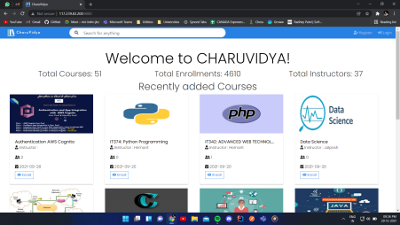
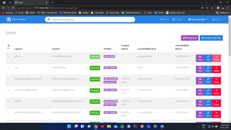
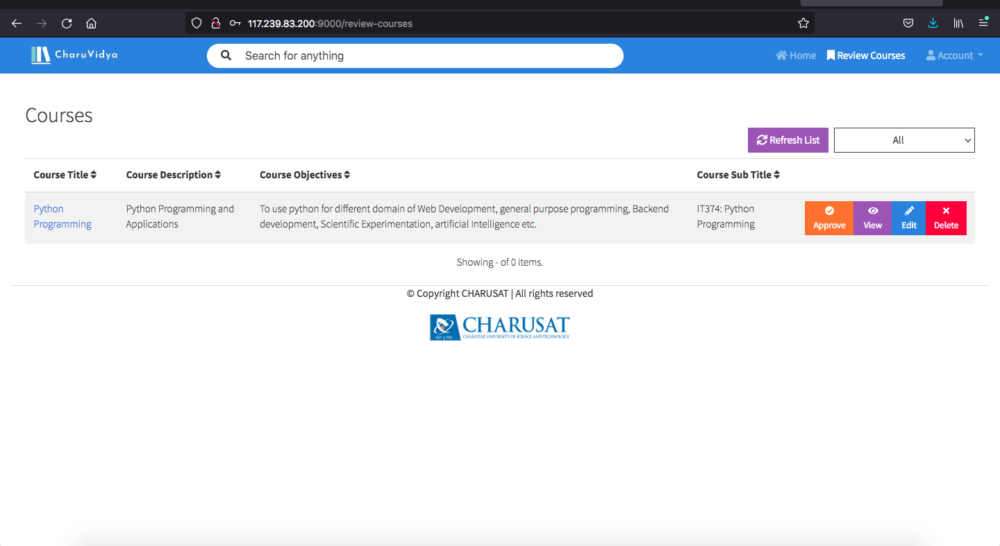
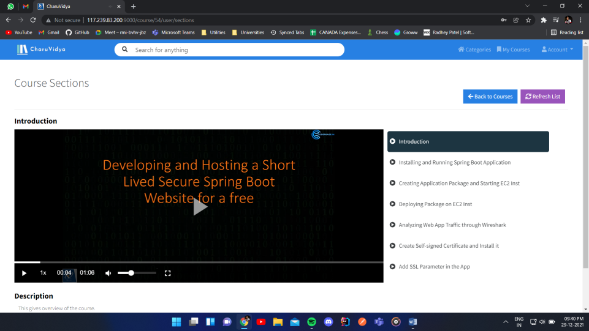
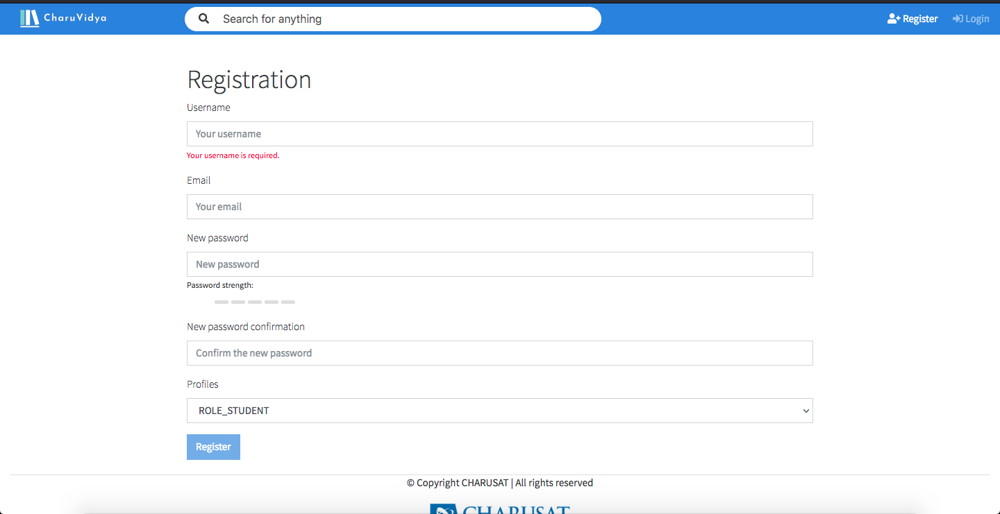

<div id="top"></div>

<!-- PROJECT LOGO -->
<br />
<div align="center">
  <p>
    
  </p>

  <h3 align="center">CharuVidya</h3>

  <p align="center">
    An E-learning application for Charotar University of Science and Technology
    <br />
  </p>
</div>


<!-- TABLE OF CONTENTS -->
<details>
  <summary>Table of Contents</summary>
  <ol>
    <li>
      <a href="#about-the-project">About The Project</a>
      <ul>
        <li><a href="#built-with">Built With</a></li>
      </ul>
    </li>
    <li>
      <a href="#getting-started">Getting Started</a>
      <ul>
        <li><a href="#prerequisites">Prerequisites</a></li>
        <li><a href="#installation">Installation</a></li>
      </ul>
    </li>
    <li><a href="#problem">Problem statement</a></li>
    <li><a href="#features">Features</a></li>
    <li><a href="#screenshots">Screenshots</a></li>
  </ol>
</details>


<!-- ABOUT THE PROJECT -->
## About The Project

CharuVidya is an e-learning application developed to aid online education and provide students with content that can be accessed anywhere anytime.

The application is developed for Charotar University of Science and Technology and is used by 5+ departments and at the moment has around 50 courses.

<p align="right">(<a href="#top">back to top</a>)</p>


### Built With

The following technologies and tools have been equipped to develop this project -

* [Spring Boot]
* [Angular]
* [MySQL]
* [JHipster]
* [AWS S3]

<p align="right">(<a href="#top">back to top</a>)</p>


<!-- GETTING STARTED -->
## Getting Started

To get a local copy up and running follow these simple example steps.

### Prerequisites

* java - jdk 8 and above
* npm 
  ```sh
  npm install npm@latest -g
  ```
* node.js
* MySQL
### Installation

_Below is an example of how you can instruct your audience on installing and setting up your app. This template doesn't rely on any external dependencies or services._

1. Clone the repo
   ```sh
   git clone https://github.com/your_username_/Project-Name.git
   ```
2. Install NPM packages
   ```sh
   npm install
   ```
3. Change username and password in application-dev.yml to connect your MySQL instance.
4. Run mvnw command to run the application
   ```sh
   ./mvnw
   ```

<p align="right">(<a href="#top">back to top</a>)</p>


<!-- Problem statement -->
## Problem
In recent times, most of the universities and colleges were forced to operate behind closed doors due to corona virus outbreak.
The online mode of education was challenging to adapt for both students as well as faculties. Prior to development of this application, faculties had to upload lecture recordings on google drive and share the drive link with students on a daily basis.
On part of the students, they had to download the videos to watch lectures. It was difficult to maintain proper sequence and flow of lectures and also uploading and downloading everyday was a cubersome task and required a lot of time to be invested.

Hence, CharuVidya provided a platform for faculties and students for easy access to the lecture materials.


<p align="right">(<a href="#top">back to top</a>)</p>


<!-- ROADMAP -->
## Features

* User friendly UI with easy navigations.
* Courses are divided into categories and sub-categories.
* An embedded video player to watch lectures in the browser itself.
* Allows faculties to attach quizzes and lecture materials for each video lecture.
* Each course goes through a thorough review process before it is available on the portal.
* Admin allocates a reviewer to each course and only after approval from the reviewer, course is available for students.

<p align="right">(<a href="#top">back to top</a>)</p>


<!-- CONTRIBUTING -->
## Screenshots
<p>
    <p>
        
    </p>
    <p>
        
    </p>
    <p>
        
    </p>
    <p>
        
    </p>
    <p>
        
    </p>
    <p>
        
    </p>
    
</p>
<p align="right">(<a href="#top">back to top</a>)</p>
